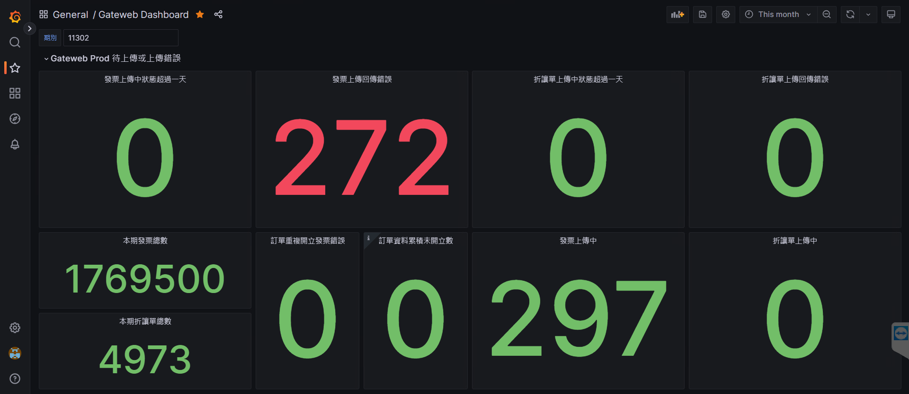

# E-Invoice system monitor
在此系統中，涉及的關係人包括
- 營業人
- 加值中心 電子發票系統 (以下簡稱為 E-Invoice System)
- 財政部 電子發票整合服務平台 (以下簡稱為 MoF)

## monitor E-Invoice system
此圖表用於監控 E-Invoice System，可從該圖表得知
- 當前正常與異常的資料數

此資訊的用途
- 便於維運工程師查看目前有哪些異常資料，並根據不同的異常類型人工介入處理

## monitor MoF
此圖表用於監控 MoF 的狀態，可從該圖表得知
- MoF 在每個時間點的回覆速度

此資訊的用途為
- 若當下回覆速度大於12小時，加值中心將發出通知，以便於回覆消費者的詢問電話)
- 可用於事後回溯，哪個時間段 MoF 曾發生異常，用於回覆稅局之來函

